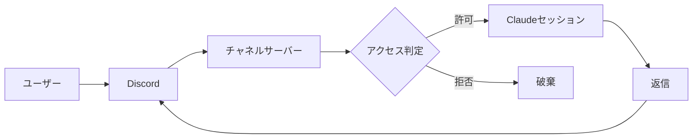

# Jarvis

Discord からメンションすると Claude Code が応答する、あなた専用の常駐 AI 秘書である。Anthropic 公式の Discord チャネルプラグイン `discord@claude-plugins-official` を使い、Discord と稼働中の Claude Code セッションを双方向に橋渡しする。スマートフォンからでも、マシン上の実ファイルに対して Claude にタスクを依頼できる。

以前は `claude` CLI を自作の TypeScript でラップする実装だったが、公式チャネルプラグインへ全面的に作り替えた。プラグインが Discord Gateway との接続・アクセス制御・返信を担うため、このリポジトリはセットアップ手順と起動・設定のテンプレートだけを受け持つ。

## Overview

メッセージはプラグインの MCP サーバーを介して流れる。サーバーが Discord に接続して許可されたメッセージだけを Claude Code セッションへ届け、Claude の返信を Discord へ送り返す。Bot はリスナーのプロセスが生きている間だけオンラインになる。



会話の記憶や認証は Claude Code 本体に委ねる。`claude` CLI がログイン済みであれば別途 API キーは要らない。

## Setup

初期設定はプラグイン導入・トークン保存・アクセス制御の登録からなる。Developer Portal での Bot 作成や OAuth 招待を含む全手順は [docs/discord-channel.md](docs/discord-channel.md) にまとめてある。要点となる設定コマンドを以下に示す。

```shell
/plugin install discord@claude-plugins-official
/reload-plugins
/discord:configure <YOUR_BOT_TOKEN>
/discord:access allow <YOUR_DISCORD_USER_ID>
/discord:access policy allowlist
```

## Running

同梱の `bin/discord-channel.sh` が PATH を整え、対話モードの `claude --channels` を常駐ループで起動する。`screen` でデタッチ起動すると端末を閉じても動き続ける。

```shell
screen -dmS discordbot ./bin/discord-channel.sh
screen -r discordbot   # 画面確認（デタッチは Ctrl-a d）
```

`-p`（print）モードは初回応答後に終了し常駐にならないため、必ず対話モードで起動する。再起動後の自動起動は設定していない。

## Access Control

誰がどこから Bot を動かせるかは `~/.claude/channels/discord/access.json` で制御する。雛形は [access.json.example](access.json.example) にある。DM は `dmPolicy` と許可リスト、チャンネルはチャンネル単位の opt-in（`groups`）とメンション要否で判定する。

設定の要点を以下に示す。

- `dmPolicy: "allowlist"` と `allowFrom` で、DM は本人だけに施錠する。
- チャンネルで反応させるには、そのチャンネル ID を `groups` に登録する。ワイルドカードは無いため、全チャンネルを対象にするなら各チャンネルを登録し、新規チャンネルは都度追加する。
- `mentionPatterns` に正規表現を加えると、実際の @メンションに加えて本文一致でも反応する。全チャンネルへ広げる場合は誤発火に注意する。

`access.json` はメッセージ受信のたびに再読込されるため、編集は即時反映され再起動は要らない。

## Repository

リポジトリの構成を以下に示す。実際のトークンと `access.json` は `~/.claude/channels/discord/` にあり、ここには含めない。

```shell
.
├── bin/
│   └── discord-channel.sh   # チャネルリスナーの起動スクリプト
├── docs/
│   └── discord-channel.md   # セットアップ全手順
└── access.json.example      # アクセス制御の雛形
```
