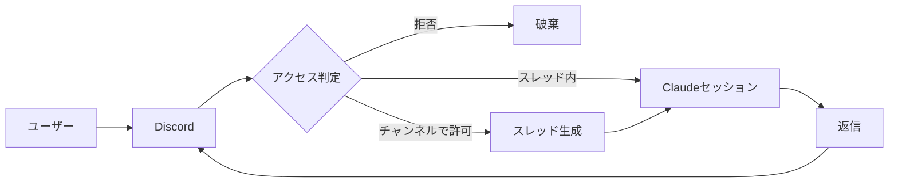

# Jarvis

Discord からメンションすると Claude Code が応答する、あなた専用の常駐 AI 秘書である。Anthropic 公式の Discord チャネルプラグイン [claude-plugins-official/discord](https://github.com/anthropics/claude-plugins-official/tree/main/external_plugins/discord) をフォークし、**チャンネルでメンションされたら自動でスレッドを作り、以降はスレッド内でメンション無しに会話を続けられる**よう拡張したものである。チャネルプロトコル・ペアリング・アクセス制御・権限リレーは公式実装のまま流用する。

トークンとアクセス設定は公式プラグインと同じ `~/.claude/channels/discord/`（`.env` と `access.json`）を共有するため、`/discord:configure` と `/discord:access` でそのまま管理できる。

## Overview

メッセージはこのプラグインの MCP サーバー（`server.ts`）を介して流れる。サーバーが Discord に接続して許可されたメッセージだけを Claude Code セッションへ届け、`reply` ツールで返信を送り返す。Bot はリスナーのプロセスが生きている間だけオンラインになる。



## Threads

このフォークの中心的な拡張がスレッドの扱いである。挙動を次に示す。

- チャンネルで `@Jarvis` とメンションすると、その発言から **スレッドを自動生成** し、`reply` の宛先（`chat_id`）をそのスレッドに向ける。Claude の返信はスレッド内に入る。
- スレッド内のメッセージは **メンション不要** で配信される（`gate()` がスレッドではメンション判定を省く）。スレッドにいる限り会話がそのまま続く。
- チャンネル本体は従来どおりメンションが必要なので、雑談チャンネルでも明示的に呼んだときだけ起動する。

公式チャネルは1セッションで全イベントを処理するため、複数スレッドの文脈は**1つの Claude セッションを共有**する。スレッドは会話の見た目を分離するが、旧自作実装のようなスレッド毎の独立セッションではない。

## Setup

Bot 作成・Message Content Intent・OAuth 招待・トークン保存・アクセス制御の全手順は [docs/discord-channel.md](docs/discord-channel.md) にまとめてある。トークンとアクセス設定は公式プラグインと共有するため、既に公式プラグインを設定済みなら追加設定は要らない。

## Running

研究プレビュー中、自作チャネルは承認許可リストに無いため `--dangerously-load-development-channels` で読み込む（許可リストのみバイパスし、組織ポリシーは有効のまま）。同梱の `bin/discord-channel.sh` がリポジトリ直下へ移動し、依存解決と常駐ループを行う。

```shell
screen -dmS discordbot ./bin/discord-channel.sh
screen -r discordbot   # 画面確認（デタッチは Ctrl-a d）
```

初回はこのディレクトリの信頼確認が出るため、一度フォアグラウンドで起動して承認しておく。同一 Bot トークンは1プロセスしか接続できないため、公式プラグインを別セッションで起動している場合は停止してから切り替える。`-p`（print）モードは常駐しないため使わない。

## Access Control

誰がどこから Bot を動かせるかは `~/.claude/channels/discord/access.json` で制御する。雛形は [access.json.example](access.json.example) にある。要点を次に示す。

- `dmPolicy: "allowlist"` と `allowFrom` で、DM は本人だけに施錠する。
- チャンネルで反応させるには、そのチャンネル ID を `groups` に登録する（ワイルドカードは無い）。スレッド内はメンション不要だが、最初の起点となる親チャンネルの登録は必要である。
- `mentionPatterns` に正規表現を足すと、実際の @メンションに加えて本文一致でも起動する。

`access.json` はメッセージ受信のたびに再読込されるため、編集は即時反映され再起動は要らない。

## Repository

主な構成を次に示す。実際のトークンと `access.json` は `~/.claude/channels/discord/` にあり、ここには含めない。

| パス | 役割 |
| :-- | :-- |
| `server.ts` | チャネルサーバー本体（公式フォーク＋スレッド生成） |
| `.mcp.json` | `server:jarvis` として起動するための MCP 設定 |
| `package.json` | 依存（`discord.js`, `@modelcontextprotocol/sdk`）と起動スクリプト |
| `bin/discord-channel.sh` | 常駐起動スクリプト |
| `docs/discord-channel.md` | セットアップ全手順 |
| `access.json.example` | アクセス制御の雛形 |
| `ACCESS.md` / `LICENSE` | 公式由来のアクセス説明と Apache-2.0 ライセンス |

## Credit

[anthropics/claude-plugins-official](https://github.com/anthropics/claude-plugins-official) の `external_plugins/discord`（Apache-2.0）をフォークし、スレッド自動生成を追加した。ライセンスは `LICENSE` を参照。
