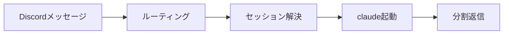

# discord-claude-code

ローカルの `claude` CLI を Discord から呼び出すスタンドアロン Bot。discord.js v14 が Gateway 接続し、メンションを受けるたびに `claude -p` をヘッドレス起動して返答する。アーキテクチャは nullevi03 同型（無限再起動ループ + 1メッセージ1プロセス）であり、Jarvis 秘書Bot とは独立した実装である。

## Overview



チャンネルでメンションすると新規スレッドが立ち、以降はそのスレッド内でメンション不要で会話を継続できる。Discord スレッドと Claude セッション（UUID）が 1:1 で対応し、 `data/sessions.json` に永続化される。

## Environment Variables

`.env.example` をコピーして `.env` を作成し、以下の変数を設定する。

| 変数名 | 必須 | 既定値 | 説明 |
| :-- | :-: | :-- | :-- |
| `DISCORD_BOT_TOKEN` | yes | — | Discord Developer Portal で取得した Bot トークン |
| `DISCORD_ALLOW_USER_IDS` | no | `283813172639563779` | 応答を許可する Discord ユーザー ID（カンマ区切り）。空にすると全員許可（非推奨） |
| `CHANNEL_CWD_MAP` | no | `{}` | チャンネル ID → 作業ディレクトリの JSON マップ（例: `{"1234":"~/projects/foo"}`）。未登録チャンネルは `DEFAULT_WORKDIR` にフォールバック |
| `DEFAULT_WORKDIR` | no | 実行ユーザーのホームディレクトリ | `CHANNEL_CWD_MAP` に載っていないチャンネルの既定 cwd（未設定時は `os.homedir()` を使用。例: `/tmp` など絶対パスを指定可） |
| `CLAUDE_PERMISSION_MODE` | no | `default` | `--permission-mode` に渡す値。 `default` / `acceptEdits` / `bypassPermissions` から選ぶ |
| `REMOTE_CONTROL_ENABLED` | no | `true` | `true` のとき `--remote-control` を付与し、Claude デスクトップアプリでセッションを確認できる |
| `CLAUDE_MODEL` | no | （claude 既定） | `--model` に渡すモデル識別子。空のとき claude 自身の既定モデルを使う |
| `DATA_DIR` | no | `./data` | `sessions.json` を保存するディレクトリ。絶対パスを推奨 |

## Setup

セットアップは以下の手順で行う。

1. 依存パッケージをインストールする。

   ```sh
   npm install
   ```

2. 設定ファイルを作成する。

   ```sh
   cp .env.example .env
   # .env を編集して DISCORD_BOT_TOKEN を設定する
   ```

3. Discord Developer Portal で **Message Content 特権インテント** を有効化する。

   - [Discord Developer Portal](https://discord.com/developers/applications) を開く。
   - 対象アプリを選択し、左メニューの **Bot** を開く。
   - **Privileged Gateway Intents** セクションで **Message Content Intent** をオンにして保存する。

4. Bot を信頼するサーバーに招待する。必要な権限スコープは以下のとおり。

   - `bot` スコープ
   - `Read Messages/View Channels`
   - `Send Messages`
   - `Create Public Threads`
   - `Send Messages in Threads`
   - `Read Message History`
   - `Add Reactions`

5. Bot を起動する。

   ```sh
   sh boot.sh
   ```

## Token Conflict

同一 `DISCORD_BOT_TOKEN` を使う他の Gateway 接続（例: 既存のプラグイン Bot `bun server.ts`）が稼働中の場合、Discord は古い接続を強制切断するため両 Bot が不安定になる。 `boot.sh` は起動時にこの旨を通知するが、他プロセスの停止は行わない。起動前に手動で確認・停止すること。

プロセスの確認と停止は以下のコマンドを使う。

```sh
# 稼働中の bun / screen セッションを確認する
ps aux | grep -E "bun|server\.ts"
screen -ls

# screen セッションを停止する（セッション名 "discord" の例）
screen -S discord -X quit

# プロセス ID が分かる場合は直接 kill する
kill <PID>
```

## Remote Control Session

`REMOTE_CONTROL_ENABLED=true`（既定）のとき、各スレッドの claude 起動には `--remote-control <name>` が付与される。セッション名は `dcc-<スレッド名スラッグ>-<スレッドID末尾8桁>` の形式になる。

Claude デスクトップアプリでセッションを確認する手順は以下のとおり。

1. Claude デスクトップアプリを起動する。
2. サイドバーまたはメニューから **Remote Sessions** / **Agents** を開く。
3. `dcc-` で始まるセッションが表示されれば接続されている。
4. セッションを選択すると、Discord 上で進行中の会話を Claude アプリ側で参照できる。

## Security

claude はローカルのファイルシステムとシェルに対してプロセス権限を持つ。Bot を起動するということは、 `DISCORD_ALLOW_USER_IDS` に列挙したユーザーにローカル環境への操作権限を与えることを意味する。

設計上の安全方針を以下に示す。

- `DISCORD_ALLOW_USER_IDS` は空にしない。空にすると全員許可になる。
- `CLAUDE_PERMISSION_MODE` の既定は `default`（claude 自身の確認フローに従う）。
- `bypassPermissions` はすべての確認プロンプトをスキップし、ファイル書き換えやシェル実行が無制限になる。隔離された信頼環境以外では使わない。
- `--dangerously-skip-permissions` は使用しない（実装から除外済み）。

## Traceability

8要件と実装チャンクの対応を以下に示す。セッション解決層（M2）が複数要件を一箇所で束ねている点が設計の核心である。

| 要件 | 内容 | 主担当 | 補強 |
| :-- | :-- | :-- | :-- |
| 1 | 全チャンネルでメンション反応 | M5 `src/index.ts` | M1 `src/config.ts`（allowlist） |
| 2 | メンションをスレッドで返信（新規スレッド生成） | M5 `src/index.ts` | M4 `src/discord.ts`（タイトル生成） |
| 3 | スレッド内はメンション不要で継続 | M5 `src/index.ts` | M2 `src/sessions.ts`（既知スレッド判定） |
| 4 | Discord スレッド ↔ Claude セッション 1:1 | M2 `src/sessions.ts` | M3 `src/claude.ts`（UUID 起動）, M5 |
| 5 | チャンネル ↔ cwd 対応 | M1 `src/config.ts`（マップ）, M3 `src/claude.ts`（spawn cwd） | M2（cwd 永続） |
| 6 | チャンネル topic をシステムプロンプト注入 | M4 `src/discord.ts`（topic 解決）, M3 `src/claude.ts`（注入） | M5 |
| 7 | スラッシュコマンド透過 | M3 `src/claude.ts`（stdin 透過） | headless 制約あり（後述） |
| 8 | `--remote-control` で Claude アプリから確認 | M3 `src/claude.ts`（付与）, M4 `src/discord.ts`（名前生成） | M6/M7（運用確認） |

## Constraints

設計上の制約と拡張ポイントを以下に示す。

- **headless スラッシュコマンド制約**: `-p` ヘッドレスモードでは claude 組み込みの `/help` 等が利用不可（"isn't available in this environment" を返す）。カスタムスラッシュコマンドやプロジェクトスラッシュは stdin 透過で動作する。全コマンドを有効にする場合は `--input-format stream-json` 常駐 PTY 方式への拡張が必要（Out of Scope）。
- **コンテナ隔離**: 要件5の cwd 切替でサンドボックスを代替している。Docker 等によるプロセス隔離は実装していない。 `src/claude.ts` の cwd 解決を差し替えることで拡張できる。
- **stream-json 常駐**: 現在の実装は1メッセージ1プロセス起動方式。長時間の対話セッション最適化が必要な場合は常駐方式への移行を検討する（Out of Scope）。

## Manual Smoke Test

ライブ疎通を確認する手順（任意・手動）を以下に示す。自動テストには含まれない。

1. 既存の同一トークン Bot を停止する（「Token Conflict」節を参照）。
2. `sh boot.sh` で Bot を起動する。
3. 任意の Discord チャンネルで Bot をメンションする（例: `@BotName こんにちは`）。
4. 新規スレッドが生成され、Bot から返信が届くことを確認する。
5. そのスレッド内でメンションなしにメッセージを送り、継続して応答が返ることを確認する。
6. Claude デスクトップアプリを開き、 `dcc-` で始まる remote-control セッションが見えることを確認する。
