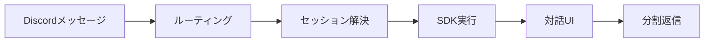

# discord-claude-code

ローカルの `claude` を Discord から呼び出すスタンドアロン Bot。discord.js v14 が Gateway 接続し、メンションを受けるたびに `@anthropic-ai/claude-agent-sdk` の `query()` で 1 ターンを実行して返答する。許可・質問・プラン承認は Discord のネイティブ UI（ボタン／セレクト）で対話的に処理する。Jarvis 秘書Bot とは独立した実装である。

## Overview



チャンネルでメンションすると新規スレッドが立ち、以降はそのスレッド内でメンション不要で会話を継続できる。Discord スレッドと Claude セッション（UUID）が 1:1 で対応し、 `data/sessions.json` に永続化される。

実行中に許可を要するツール・`AskUserQuestion`・プラン承認が発生すると、Bot がスレッドへボタンやセレクトメニューを提示し、ユーザーの選択を Claude へ返す。これにより対話的な確認を Discord 上で完結できる（設計の詳細は [docs/interactive-ui.md](docs/interactive-ui.md)）。認証は端末にログイン済みの `claude` 資格情報をそのまま利用する（`ANTHROPIC_API_KEY` は不要）。

スレッドをアーカイブ／削除すると、対応するセッションは閉じられ `sessions.json` から破棄される。閉じたスレッドでは以後（メンションが無い限り）応答しない。アーカイブ解除（新規メッセージ投稿）時は新規スレッド扱いとなり、メンションすれば直近履歴を文脈として引き継いで再開する。

起動はメンションに統一し、Bot 独自の Discord slash command は登録しない。メンション本文の先頭を `/` で始めると（例: `@BotName /review`）、メンションを除いた `/review …` がそのまま Claude へ渡り、Claude Code の slash command として解釈・実行される（要件7）。これにより Claude Code の任意のコマンドを Discord から透過的に利用できる。

## Environment Variables

`.env.example` をコピーして `.env` を作成し、以下の変数を設定する。

| 変数名 | 必須 | 既定値 | 説明 |
| :-- | :-: | :-- | :-- |
| `DISCORD_BOT_TOKEN` | yes | — | Discord Developer Portal で取得した Bot トークン |
| `DISCORD_ALLOW_USER_IDS` | no | `283813172639563779` | 応答を許可する Discord ユーザー ID（カンマ区切り）。空にすると全員許可（非推奨） |
| `CHANNEL_CWD_MAP` | no | `{}` | チャンネル ID → 作業ディレクトリの JSON マップ（例: `{"1234":"~/projects/foo"}`）。値の先頭 `~` はホームに展開し、相対パスは絶対パスへ解決する。未登録チャンネルは `DEFAULT_WORKDIR` にフォールバック |
| `DEFAULT_WORKDIR` | no | 実行ユーザーのホームディレクトリ | `CHANNEL_CWD_MAP` に載っていないチャンネルの既定 cwd（未設定時は `os.homedir()` を使用）。`~`・相対パスは展開・絶対パス化される（例: `~/projects`） |
| `CLAUDE_PERMISSION_MODE` | no | `default` | パーミッションモード。`default` で対話的な許可確認が発火する。`acceptEdits` は編集を自動受理、`bypassPermissions` は全確認を省略（対話 UI を活かすには `default`） |
| `CLAUDE_TIMEOUT_MS` | no | `1800000`（30分） | 1ターンあたりのタイムアウト（ミリ秒）。`0` で無効。許可・質問・プランの応答待ちも含むため十分長く取る。到達時は AbortController で query を中断 |
| `INTERACTION_TIMEOUT_MS` | no | `300000`（5分） | 対話 UI（許可・質問・プラン承認）のボタン／セレクト応答待ちタイムアウト（ミリ秒）。`0` で無効（`CLAUDE_TIMEOUT_MS` に委ねる）。到達時は安全側＝拒否 |
| `REMOTE_CONTROL_ENABLED` | no | `true` | `true` のとき新規セッションのタイトルに安定名 `dcc-…` を付与し、Claude アプリの履歴で識別可能にする（旧 `--remote-control` は廃止、後述） |
| `CLAUDE_MODEL` | no | （claude 既定） | 使用するモデル識別子。空のとき claude 自身の既定モデルを使う |
| `DATA_DIR` | no | `./data` | `sessions.json` を保存するディレクトリ。絶対パスを推奨 |

## Setup

前提として、この端末で `claude` にログイン済みであること。SDK はその資格情報をそのまま利用するため、`ANTHROPIC_API_KEY` の設定は不要である（未ログインなら `claude` を一度起動してログインする）。セットアップは以下の手順で行う。

1. 依存パッケージをインストールする。

   ```sh
   npm install
   ```

2. 設定ファイルを作成する。

   ```sh
   cp .env.example .env
   # .env を編集して DISCORD_BOT_TOKEN を設定する
   ```

3. Discord Developer Portal で **Message Content 特権インテント** を有効化する。

   - [Discord Developer Portal](https://discord.com/developers/applications) を開く。
   - 対象アプリを選択し、左メニューの **Bot** を開く。
   - **Privileged Gateway Intents** セクションで **Message Content Intent** をオンにして保存する。

4. Bot を信頼するサーバーに招待する。必要な権限スコープは以下のとおり。

   - `bot` スコープ
   - `Read Messages/View Channels`
   - `Send Messages`
   - `Create Public Threads`
   - `Send Messages in Threads`
   - `Read Message History`
   - `Add Reactions`

5. Bot を起動する。

   ```sh
   sh boot.sh
   ```

## Token Conflict

同一 `DISCORD_BOT_TOKEN` を使う他の Gateway 接続（例: 既存のプラグイン Bot `bun server.ts`）が稼働中の場合、Discord は古い接続を強制切断するため両 Bot が不安定になる。 `boot.sh` は起動時にこの旨を通知するが、他プロセスの停止は行わない。起動前に手動で確認・停止すること。

プロセスの確認と停止は以下のコマンドを使う。

```sh
# 稼働中の bun / screen セッションを確認する
ps aux | grep -E "bun|server\.ts"
screen -ls

# screen セッションを停止する（セッション名 "discord" の例）
screen -S discord -X quit

# プロセス ID が分かる場合は直接 kill する
kill <PID>
```

## Session Identification

`REMOTE_CONTROL_ENABLED=true`（既定）のとき、新規セッションのタイトルに安定名 `dcc-<スレッド名スラッグ>-<スレッドID末尾8桁>` を付与する。Claude アプリのセッション履歴でこの名前を頼りに該当スレッドのセッションを特定できる。

旧実装の `--remote-control` フラグは廃止した。このフラグは対話セッション専用で SDK の headless `query()` と非互換であり、かつ本来の用途（Claude アプリ側で許可・質問へ応答する）は Discord ネイティブの対話 UI（Issue #2）が直接満たすためである。`false` を設定するとタイトル付与も行わない。

## Security

claude はローカルのファイルシステムとシェルに対してプロセス権限を持つ。Bot を起動するということは、 `DISCORD_ALLOW_USER_IDS` に列挙したユーザーにローカル環境への操作権限を与えることを意味する。

設計上の安全方針を以下に示す。

- `DISCORD_ALLOW_USER_IDS` は空にしない。空にすると全員許可になる。
- `CLAUDE_PERMISSION_MODE` の既定は `default`（claude 自身の確認フローに従う）。
- `bypassPermissions` はすべての確認プロンプトをスキップし、ファイル書き換えやシェル実行が無制限になる。隔離された信頼環境以外では使わない。
- `--dangerously-skip-permissions` は使用しない（実装から除外済み）。

## Traceability

要件と実装チャンクの対応を以下に示す。セッション解決層（M2）が複数要件を一箇所で束ねている点が設計の核心である。

| 要件 | 内容 | 主担当 | 補強 |
| :-- | :-- | :-- | :-- |
| 1 | 全チャンネルでメンション反応 | M5 `src/index.ts` | M1 `src/config.ts`（allowlist） |
| 2 | メンションをスレッドで返信（新規スレッド生成） | M5 `src/index.ts` | M4 `src/discord.ts`（タイトル生成） |
| 3 | スレッド内はメンション不要で継続 | M5 `src/index.ts` | M2 `src/sessions.ts`（既知スレッド判定） |
| 4 | Discord スレッド ↔ Claude セッション 1:1 | M2 `src/sessions.ts` | M3 `src/claude.ts`（UUID 起動）, M5 |
| 5 | チャンネル ↔ cwd 対応 | M1 `src/config.ts`（マップ）, M3 `src/claude.ts`（query cwd） | M2（cwd 永続） |
| 6 | チャンネル topic をシステムプロンプト注入 | M4 `src/discord.ts`（topic 解決）, M3 `src/claude.ts`（append 注入） | M5 |
| 7 | スラッシュコマンド透過 | M3 `src/claude.ts`（prompt 透過） | SDK query で処理 |
| 8 | Claude アプリからセッション確認 | M3 `src/claude.ts`（タイトル付与）, M4 `src/discord.ts`（名前生成） | 対話 UI（#2）が応答用途を代替 |
| #2 | 対話 UI（許可・質問・プラン承認） | `src/interactive.ts`（canUseTool ブリッジ） | M3 `src/claude.ts`（SDK 接続）, M5 |

## Constraints

設計上の制約と拡張ポイントを以下に示す。

- **対話 UI の範囲**: `AskUserQuestion` の選択肢は SDK が提示する `options` に限定し、自由記述（「その他」）は扱わない。ツール実行中の中間テキストはストリーミングせず最終結果のみ返信する。詳細と拡張余地は [docs/interactive-ui.md](docs/interactive-ui.md) を参照。
- **コンテナ隔離**: 要件5の cwd 切替でサンドボックスを代替している。Docker 等によるプロセス隔離は実装していない。 `src/claude.ts` の cwd 解決を差し替えることで拡張できる。
- **タイムアウト**: 1ターン全体は `CLAUDE_TIMEOUT_MS`、対話 UI の応答待ちは `INTERACTION_TIMEOUT_MS` で制限する。前者は許可待ち時間も含むため十分長く取る。

## Manual Smoke Test

ライブ疎通を確認する手順（任意・手動）を以下に示す。自動テストには含まれない。

1. 既存の同一トークン Bot を停止する（「Token Conflict」節を参照）。
2. `sh boot.sh` で Bot を起動する。
3. 任意の Discord チャンネルで Bot をメンションする（例: `@BotName こんにちは`）。
4. 新規スレッドが生成され、Bot から返信が届くことを確認する。
5. そのスレッド内でメンションなしにメッセージを送り、継続して応答が返ることを確認する。
6. ファイル作成など許可を要する依頼をして、許可ボタン（許可／常に許可／拒否）が提示され、選択どおりに動くことを確認する。
7. メンション本文を `/` で始めて Claude Code の slash command（例: `@BotName /context`）を送り、コマンドとして実行された結果が返ることを確認する（要件7: 透過）。
8. Claude アプリのセッション履歴に `dcc-` で始まるタイトルのセッションが見えることを確認する。
