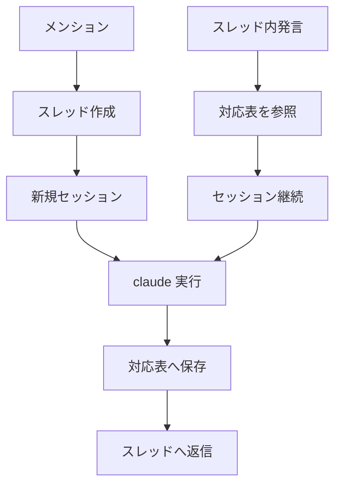

# Jarvis

あなた専用のAI秘書。Discord でメンションすると、Claude Code があなたに代わって応答する常駐ボットである。 [GOROman/nullevi03](https://github.com/GOROman/nullevi03) の「Claude Code を messaging に常駐させる」思想を受け継ぎつつ、Telegram を Discord に置き換え、会話の単位をスレッドに対応させた。

## Overview

Jarvis は、 `claude` CLI をヘッドレス実行する薄いラッパーである。秘書としての頭脳は Claude Code 本体が担い、このリポジトリは Discord とのつなぎ込みと、会話の対応付けだけを受け持つ。

本質は「Discord スレッド ↔ Claude セッションの 1 対 1 対応」という一点に集約される。各スレッドは固有の `session_id` を持ち、メッセージが届くたびに `claude --resume` でそのセッションを継続するため、過去の文脈が自然に引き継がれる。追加のデータベースや埋め込み検索を持たず、Claude Code のセッション履歴をそのまま会話の記憶として使う。

認証は Claude Code のサブスクリプションをそのまま利用する。 `claude` CLI がログイン済みであれば、別途 API キーは要らない。

## Architecture

メンションを起点にスレッドを作り、そのスレッドIDをセッションIDへ対応付けて永続化する。次回以降は同じセッションを継続する。



対応表は `data/sessions.json` に保存され、 `threadId` をキーに `sessionId` を引く。このファイルは Git 管理外であり、Bot を再起動しても会話は途切れない。

## Prerequisites

動作には次の3つが必要である。

- Node.js `20` 以上。
- ログイン済みの `claude` CLI（Claude Code）。 `claude --version` で確認できる。
- Discord アカウントと、自分で作成する Bot アプリケーション。

## Setup

### Discord application

[Discord Developer Portal](https://discord.com/developers/applications) で Bot を作成し、トークンを取得する。手順は次のとおりである。

1. New Application でアプリを作成する。
2. 左メニュー Bot を開き、 Privileged Gateway Intents の Message Content Intent を有効にする。
3. Reset Token を押してトークンをコピーする。トークンは一度しか表示されない。

### Environment

リポジトリ直下で `.env` を用意し、トークンを設定する。

```sh
cp .env.example .env
# .env の DISCORD_BOT_TOKEN に取得したトークンを貼る
npm install
```

### Dedicated server

専用サーバーは付属スクリプトが自動作成する。サーバー・チャンネル・参加用の招待リンクをまとめて発行し、 `JARVIS_GUILD_ID` と `JARVIS_CHANNEL_ID` を `.env` に書き込む。

```sh
npm run setup
```

出力された招待リンクを開き、自分のアカウントでサーバーに参加する。

### Launch

`boot.sh` は Bot を常駐させ、停止しても自動で再起動する。

```sh
./boot.sh
```

## Usage

専用サーバーの `#jarvis` チャンネルで Bot にメンションすると会話が始まる。使い方の要点は次のとおりである。

- チャンネルで `@Jarvis` とメンションすると、その発言からスレッドが作られ、秘書がスレッド内で応答する。
- スレッド内では、メンションなしで発言を続けるだけで会話が継続する。
- 別の話題は、チャンネルで改めてメンションすると新しいスレッドとして独立する。

スレッドごとに会話が独立し、それぞれの文脈が保たれる。

## Configuration

`.env` で挙動を調整する。各変数の意味を次に示す。

| 変数 | 必須 | 既定 | 説明 |
| :-- | :-: | :-- | :-- |
| `DISCORD_BOT_TOKEN` | 必須 | なし | Discord Bot のトークン。 |
| `JARVIS_GUILD_ID` | 任意 | 全サーバー | 反応する専用サーバー。 `npm run setup` が自動記入する。 |
| `JARVIS_CHANNEL_ID` | 任意 | 全チャンネル | 反応するチャンネル。 `npm run setup` が自動記入する。 |
| `CLAUDE_PERMISSION_MODE` | 任意 | `default` | claude の権限。道具を使わせるなら `bypassPermissions` 。 |
| `JARVIS_WORKDIR` | 任意 | `./workspace` | claude が動く作業ディレクトリ。 |
| `CLAUDE_MODEL` | 任意 | 既定モデル | 使う Claude モデル。 |
| `JARVIS_DATA_DIR` | 任意 | `./data` | 対応表の保存先。 |

## Notes

秘書の人格や口調は `src/persona.ts` を書き換えると変わる。会話だけなら `CLAUDE_PERMISSION_MODE` は `default` のままでよいが、ファイル操作などの道具を使わせる場合は権限を上げる必要があり、その分だけ実行できる操作も広がる点に注意する。
