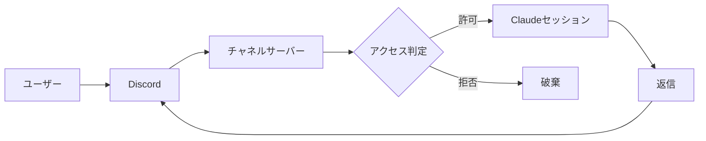

# Discord Channel Setup

Anthropic 公式の Discord チャネルプラグイン `discord@claude-plugins-official` を使い、Discord と稼働中の Claude Code セッションを双方向に橋渡しする手順をまとめる。Discord に届いたメッセージが実行中セッションにイベントとして到着し、Claude が同じチャネルへ返信する。常駐させるとスマートフォンからでも Claude にタスクを依頼できる。

公式ドキュメントは [code.claude.com/docs/ja/channels](https://code.claude.com/docs/ja/channels) を参照する。

## Overview

メッセージは次の経路で流れる。プラグインの MCP サーバー（`bun server.ts`）が Discord Gateway に接続し、許可されたメッセージだけを Claude Code セッションへ届け、Claude の返信を Discord へ送り返す。



アクセス判定は DM と guild チャンネルで異なる。DM は `dmPolicy` と許可リストで制御し、チャンネルはチャンネル単位の opt-in（`groups`）とメンション要否で制御する。

## Prerequisites

実行には以下が必要である。バージョンや認証は事前に整えておく。

- [Bun](https://bun.sh)。プラグインの MCP サーバーは Bun スクリプトとして動く。
- Claude Code v2.1.80 以降と、claude.ai もしくは Console API キーによる認証。
- Discord アプリ（Bot）。トークンは Developer Portal から取得する。

## Setup

一度だけ実施する初期設定を順に示す。トークンや ID は各自の値に置き換える。

### Developer Portal

[Discord Developer Portal](https://discord.com/developers/applications) で Bot を作成し、次を設定する。

- `Bot` セクションで `Reset Token` を押してトークンをコピーする。
- `Privileged Gateway Intents` の `Message Content Intent` を有効化する。
- `OAuth2 > URL Generator` で `bot` スコープと権限（View Channels / Send Messages / Send Messages in Threads / Read Message History / Attach Files / Add Reactions）を選び、生成 URL から Bot をサーバーへ追加する。

### Plugin And Token

Claude Code でプラグインを導入し、トークンを保存する。設定コマンドを以下に示す。

```shell
/plugin install discord@claude-plugins-official
/reload-plugins
/discord:configure <YOUR_BOT_TOKEN>
```

トークンは `~/.claude/channels/discord/.env` の `DISCORD_BOT_TOKEN` に保存される。このファイルと `access.json` はランタイムデータであり、リポジトリには含めない。

### Access Control

許可リストと施錠、チャンネル開放を設定する。`access.json` は編集のたびにサーバーが再読込するため即時反映される。主なコマンドを次に示す。

| Command | Purpose |
| :-- | :-- |
| `/discord:access allow <YOUR_DISCORD_USER_ID>` | 送信者を許可リストに追加する |
| `/discord:access policy allowlist` | DM を許可リスト限定に施錠する |
| `/discord:access group add <CHANNEL_ID>` | チャンネルで @メンションに応答させる |
| `/discord:access set mentionPatterns <json>` | 表記ゆれでも反応する正規表現を登録する |
| `/discord:access pair <code>` | DM ペアリングのコードを承認する |

ユーザー ID は Discord の Developer Mode を有効にして `Copy User ID` で取得できる。ペアリングを使わずこの ID 直接指定で許可リストを作る方が確実である。

### All Channels

チャンネル応答は `groups[channelId]` に登録されたチャンネルでのみ有効で、全チャンネルを一括で表すワイルドカードは標準にはない。全チャンネルで反応させたい場合は、サーバーの全テキストチャンネルを `groups` に登録する。新規チャンネルを作成したときは都度追加が必要になる。チャンネル一覧は次のように取得し、`type` が `0` / `5` / `15`（テキスト / アナウンス / フォーラム）の ID を `groups` に追加して、それぞれ `requireMention` と `allowFrom` を設定する。

```shell
TOKEN=$(grep '^DISCORD_BOT_TOKEN=' ~/.claude/channels/discord/.env | cut -d= -f2-)
curl -s -A "DiscordBot" -H "Authorization: Bot $TOKEN" \
  "https://discord.com/api/v10/guilds/<GUILD_ID>/channels"
```

## Access File

設定の実体は `~/.claude/channels/discord/access.json` にある。リポジトリ同梱の `access.json.example` が雛形である。DM は本人のみ許可し、指定チャンネルで @メンションに反応する構成を示す。

```json
{
  "dmPolicy": "allowlist",
  "allowFrom": ["<YOUR_DISCORD_USER_ID>"],
  "groups": {
    "<CHANNEL_ID>": {
      "requireMention": true,
      "allowFrom": ["<YOUR_DISCORD_USER_ID>"]
    }
  },
  "pending": {},
  "mentionPatterns": ["<@!?<BOT_APPLICATION_ID>>"]
}
```

`requireMention` を `true` にすると、そのチャンネルでは @メンションされたメッセージのみ Claude に届く。`mentionPatterns` は正規表現の配列で、実際の @メンションに加えて本文がパターンに一致した場合もメンション扱いにする。たとえば `@?jarvis` を加えると本文に「jarvis」と含むだけで発火するため、全チャンネルに広げる場合は誤発火に注意する。`allowFrom` を空にするとそのチャンネルを見られる全員が操作できるため、本人限定にする場合は ID を明記する。

## Running

Bot はチャネルリスナーのプロセスが生きている間だけオンラインになる。本リポジトリは公式 discord プラグインのフォーク（スレッド自動生成つき）であり、自作チャネルは承認許可リストに無いため `--dangerously-load-development-channels server:jarvis` で読み込む（許可リストのみバイパスし、組織ポリシーは有効）。同梱の `bin/discord-channel.sh` がリポジトリ直下へ移動し、依存解決と常駐ループを行う。

```shell
screen -dmS discordbot ./bin/discord-channel.sh
screen -r discordbot   # 画面確認（デタッチは Ctrl-a d）
```

初回はこのディレクトリの信頼確認が出るため、一度フォアグラウンドで起動して承認しておく。同一 Bot トークンは1プロセスのみ接続できるため、公式プラグインを別セッションで起動している場合は停止してから切り替える。`-p`（print）モードは常駐しない。再起動後の自動起動は設定していない。

## Troubleshooting

つまずきやすい点と対処を以下に示す。

| Symptom | Cause And Fix |
| :-- | :-- |
| Bot がオフライン | リスナー未起動。`bin/discord-channel.sh` を起動する |
| `-p` 起動ですぐ終了 | print モードは常駐しない。対話モードで起動する |
| DM が無反応 | 送信者が許可リスト外。`/discord:access allow <id>` を実行する |
| チャンネル @メンションが無反応 | チャンネル未登録。`/discord:access group add <id>` を実行する |
| Bot は接続済みだが返信しない | リスナーの Claude セッションが落ちている。再起動する |
