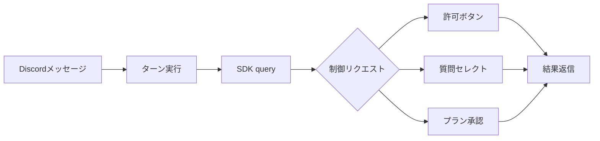

# Interactive UI

Issue #2（Discord 上で対話 UI を扱う：許可プロンプト・`AskUserQuestion`・プラン承認）の設計と実装をまとめる。結論として、対話 UI は `@anthropic-ai/claude-agent-sdk` の `canUseTool` コールバックを Discord のネイティブ UI（ボタン／セレクトメニュー）へ橋渡しすることで実現する。生 stream-json では許可が自動拒否され対話化できなかった制約を、SDK の制御チャネルで根本的に解消する。

## Background

旧実装は `claude -p` を「1 メッセージ 1 プロセス」で spawn し、標準入出力で生の stream-json を授受していた。この方式では Claude Code の対話 UI（選択肢・プラン承認・許可プロンプト）が Discord に描画されず、許可を要するツールは自動的に拒否された。回避策はセッションを `--remote-control` で起動し Claude アプリ側で応答する運用に限られていた。

SDK 方式はこの構造を置き換える。各ターンを `query()` で実行し、ツール実行の可否を `canUseTool` が仲介する。許可・質問・プランの各制御リクエストをこのコールバックで受け取り、Discord のコンポーネントとして提示してユーザーの選択を SDK へ返す。

## Verification

実装に先立ち、SDK（`@anthropic-ai/claude-agent-sdk` 0.3.x）の実挙動を実機で検証した。検証で確認した事実を以下に示す。

| 観点 | 確認結果 |
| :-- | :-- |
| 認証 | 端末にログイン済みの `claude` 資格情報をそのまま利用する（`apiKeySource: none` でも応答）。`ANTHROPIC_API_KEY` は不要 |
| 許可プロンプト | `canUseTool` が全ツール実行前に発火する。`title` は headless では未設定のため本文は自前生成が必要 |
| 許可応答の形 | `behavior:"allow"` は `updatedInput` を必須とする。元の input をそのまま返してよいが、省くと SDK が `ZodError`（Invalid input）で弾き、ツールが実行されない（許可したのに何も起きない）。`deny` は `message` のみ |
| cwd | `Options.cwd` は spawn される claude のプロセス cwd を正しく設定する（`pwd` で検証）。ツールの相対パスはこの cwd 基準で解決される（要件5） |
| `AskUserQuestion` | `canUseTool` に `{questions:[{question, header, options, multiSelect}]}` が渡る。`{behavior:"allow", updatedInput:{questions, answers}}` で回答を返すとモデルが受領し継続する |
| `ExitPlanMode` | `canUseTool` の `input.plan` に計画本文（Markdown）が入る。`deny` で計画モードを継続、`allow`（＋`updatedInput`）で承認となる |
| `setMode` | `updatedPermissions` の `setMode(acceptEdits)` は `canUseTool` を抑止しない。`canUseTool` を渡している間は全ツールで発火し続けるため、承認後の編集自動受理はブリッジ側の状態で代替する（実機の Discord 検証で確認） |

## Architecture

各 Discord メッセージを 1 ターンの `query()` として実行し、`canUseTool` をスレッドに束ねたブリッジへ接続する。セッションは新規時に `sessionId`、継続時に `resume` で UUID を指定し、スレッドと 1:1 で対応させる。

ブリッジ（`src/interactive.ts`）は `canUseTool` の呼び出しをツール名で振り分ける。`AskUserQuestion` と `ExitPlanMode` は専用のレンダラへ、それ以外は汎用の許可レンダラへ渡す。各レンダラは Discord メッセージにコンポーネントを添えて送信し、応答を待って `PermissionResult` を返す。

## Control Flows

3 つの制御フローを Discord UI へ対応づける。いずれも操作可能なユーザーを `DISCORD_ALLOW_USER_IDS`（空＝全員）に限定し、応答待ちは `INTERACTION_TIMEOUT_MS`（既定 5 分）で打ち切って安全側（拒否）へ倒す。

| フロー | トリガ | UI | 戻り値 |
| :-- | :-- | :-- | :-- |
| 許可 | 任意のツール実行 | ボタン（許可／常に許可／拒否） | allow＋updatedInput ／ allow＋updatedInput＋updatedPermissions ／ deny |
| 質問 | `AskUserQuestion` | 質問ごとのセレクトメニュー | allow＋updatedInput.answers |
| プラン承認 | `ExitPlanMode` | 計画本文＋ボタン（承認／却下） | allow＋updatedInput＋setMode(acceptEdits) ／ deny |

いずれの許可結果も `updatedInput` を伴う点が要諦である。Verification 節のとおり、これを省くと SDK が許可応答を `ZodError` で拒否しツールが実行されないため、各レンダラは元の input（質問フローでは回答を加えた input）を必ず返す。

「常に許可」は `canUseTool` が渡す `suggestions` を `updatedPermissions` として返し、同一セッション内で同じツールを再確認しない。プラン承認後はブリッジ単位の状態を `acceptEdits` に切り替え、編集ツール（Write・Edit・MultiEdit・NotebookEdit）を無確認で自動許可して実行中の逐次プロンプトでスレッドを埋めない。`setMode(acceptEdits)` 単体では `canUseTool` を抑止できない（Verification 節）ため、この自動許可はブリッジ側で担う。Bash 等の非編集ツールは承認後も確認を継続する。状態はスレッド（ブリッジ）に閉じ、別スレッドへ波及しない。

計画モードの起動は専用 UI を設けず、`CLAUDE_PERMISSION_MODE`（既定 `default`、`plan` 指定可）に従う。`plan` モードのターンでモデルが `ExitPlanMode` を呼んだ時点で、本ブリッジが計画本文と承認／却下ボタンを提示する。Bot 独自の Discord slash command は登録せず、`/` で始まる本文は Claude へ透過して Claude Code の slash command として実行する（要件7）。

## Permission Mode

`CLAUDE_PERMISSION_MODE` の既定 `default` で `canUseTool` が許可プロンプトを発火させ、Discord 上の対話確認が成立する。`acceptEdits` は編集を自動受理し、`bypassPermissions` はすべての確認を省略するため、対話 UI を活かすには `default` を使う。

## Constraints

実装上の制約と非対応範囲を以下に示す。

- 選択肢は SDK が提示する `options` に限定し、`AskUserQuestion` の自由記述（「その他」）は扱わない。Discord のセレクトメニューが自由入力を持たないためで、必要ならモーダル入力での拡張余地がある。
- ツール実行中の中間テキストはストリーミングせず、ターンの最終結果のみを分割返信する。対話 UI（許可・質問・プラン）が進行状況の可視化を兼ねる。
- 旧 `--remote-control` は対話セッション専用フラグで headless `query()` と非互換のため使用しない。要件8（Claude アプリでのセッション確認）は、新規セッションのタイトルに安定名 `dcc-…` を付与して履歴から識別可能にすることで代替する。
- ボタン／セレクトの応答待ちは `INTERACTION_TIMEOUT_MS` で、ターン全体は `CLAUDE_TIMEOUT_MS` で制限する。後者は許可待ち時間も含むため十分長く取る。
