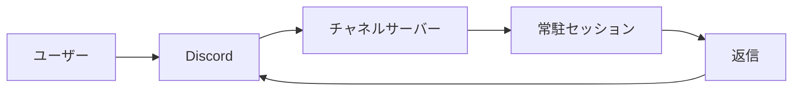

# Interactive UI

Issue #2（Discord 上で対話 UI を扱う：`AskUserQuestion` / プラン承認 / 許可）への調査結果と方針をまとめる。結論として、対話 UI は本 PR の one-shot Bot へ独自実装するのではなく、Anthropic 公式の Discord チャネルプラグイン（常駐セッション方式）を採用して実現するのが妥当である。

## Background

本 PR の Bot は `claude -p --output-format json` による「1 メッセージ 1 プロセス」のヘッドレス起動で動作する。プロセスはターンごとに生成・終了するため、Claude Code の対話 UI（選択肢ボタン・プラン承認・許可プロンプト）が Discord 上に描画されない。現状の回避策は、各セッションを `--remote-control` 付きで起動し、同じセッションを Claude アプリ側で開いて対話に応答する方法である（要件8）。

## Findings

実機（`claude` 2.1.168）で stream-json 双方向モードを検証した結果、生の標準入出力だけでは対話的な許可・質問・プラン承認を扱えないことを確認した。出力は改行区切り JSON で、`system`（`init` ほか）・`assistant`（`content[].text`）・`result`（`is_error` / `result` / `session_id`）・`rate_limit_event` などのイベントから成る。入力は `{"type":"user","message":{"role":"user","content":"..."}}` を受け付ける。

許可を要するツールを生 stream-json で実行させたところ、対話的な `control_request` は発行されず自動的に拒否された。返却された `tool_result` は次のとおりで、`is_error` が `true` であった。

```text
Claude requested permissions to write to .../probe.txt, but you haven't granted it yet.
```

したがって対話 UI には、許可・質問・プラン承認を仲介する制御チャネルが別途必要であり、生の stdin/stdout 透過だけでは要件を満たせない。

## Architecture Options

対話 UI を成立させる方式を比較する。対応範囲は「許可（ツール実行可否）」と「質問・プラン（`AskUserQuestion` / `ExitPlanMode`）」に分けて評価する。

| 方式 | 対話的な許可 | 質問・プラン | 追加依存 | 備考 |
| :-- | :-: | :-: | :-- | :-- |
| 生 stream-json 透過 | 不可（自動拒否） | 不可 | なし | 本 PR の延長。要件未達 |
| MCP `--permission-prompt-tool` | 可 | 不可 | MCP サーバ実装 | 許可のみ橋渡し。Bot との IPC が複雑 |
| `@anthropic-ai/claude-agent-sdk` | 可 | 可 | SDK | `canUseTool` / hooks で堅牢。重い依存追加 |
| 公式 Discord チャネルプラグイン | 可（セッション側） | 可（セッション側） | Bun / プラグイン | 常駐セッション。Discord ボタンは非対応 |

## Official Plugin

Anthropic 公式の Discord チャネルプラグイン `discord@claude-plugins-official` は、Claude Code を常駐の対話セッションとして起動し、Discord を MCP チャネルとして双方向に橋渡しする。Discord に届いたメッセージが実行中セッションへイベントとして到着し、Claude が同じチャネルへ返信する。これは Issue #2 の想定アプローチ（ワンショットからスレッド単位の常駐セッションへ）と同一の構造である。



プラグインが公開する MCP ツールは送受信の transport に限られ、`reply` / `react` / `edit_message` / `fetch_messages` / `download_attachment` から成る。`AskUserQuestion` やプラン承認、許可プロンプトを Discord のボタン・モーダルとして描画する機能は公式プラグインにも存在しない。これらの対話フローは常駐セッション側で処理され、ユーザーは Discord のテキスト応答、または `--remote-control` 経由で応答する。

本リポジトリでは作業ブランチ `feat/migrate-to-channel-plugin` で既にこの公式プラグインを fork・採用しており（`server.ts` / `bin/` / `docs/discord-channel.md`）、常駐セッション方式への移行が進んでいる。

## Recommendation

Issue #2 は本 PR の one-shot Bot に独自の対話 UI を実装するのではなく、公式 Discord チャネルプラグインの採用で解決することを推奨する。理由は次の三点である。第一に、公式プラグインは #2 が求める常駐対話セッションそのものであり、対話フロー（許可・質問・プラン）をセッション側で完結できる。第二に、`feat/migrate-to-channel-plugin` で既に採用が進んでおり、保守された経路に乗れる。第三に、生 stream-json への独自実装は要件を満たせず、SDK 追加や MCP 橋渡しは依存増と検証困難（Discord 往復の実機検証が必須）を伴うため、本 PR の最小依存方針（`discord.js` / `dotenv` のみ）と相容れない。

リテラルな「Discord ネイティブのボタン UI」が必要な場合は、公式プラグインに依存しない上乗せ機能として、`@anthropic-ai/claude-agent-sdk` の `canUseTool` を用いた別 PR で扱う。許可・質問・プランの各制御リクエストを Discord の Buttons / Select / Modal にマッピングし、応答を制御チャネルへ返す設計とする。

## Verification

ローカルで検証済みなのは stream-json の入出力イベント形状と、生モードでの許可自動拒否の挙動である。Discord コンポーネントの往復（ボタン押下から制御応答までの一巡）は、Bot トークンと実サーバでの操作を要するため本環境では検証できない。実装に進む場合は実機での疎通確認を前提とする。
